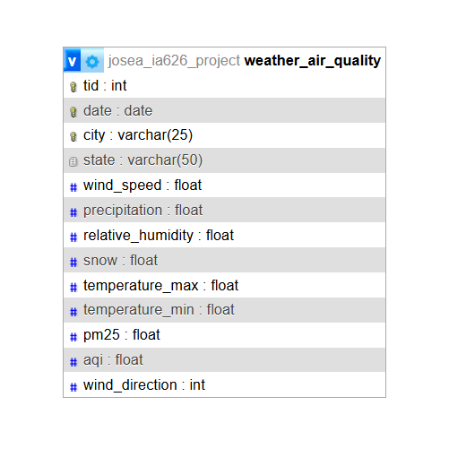
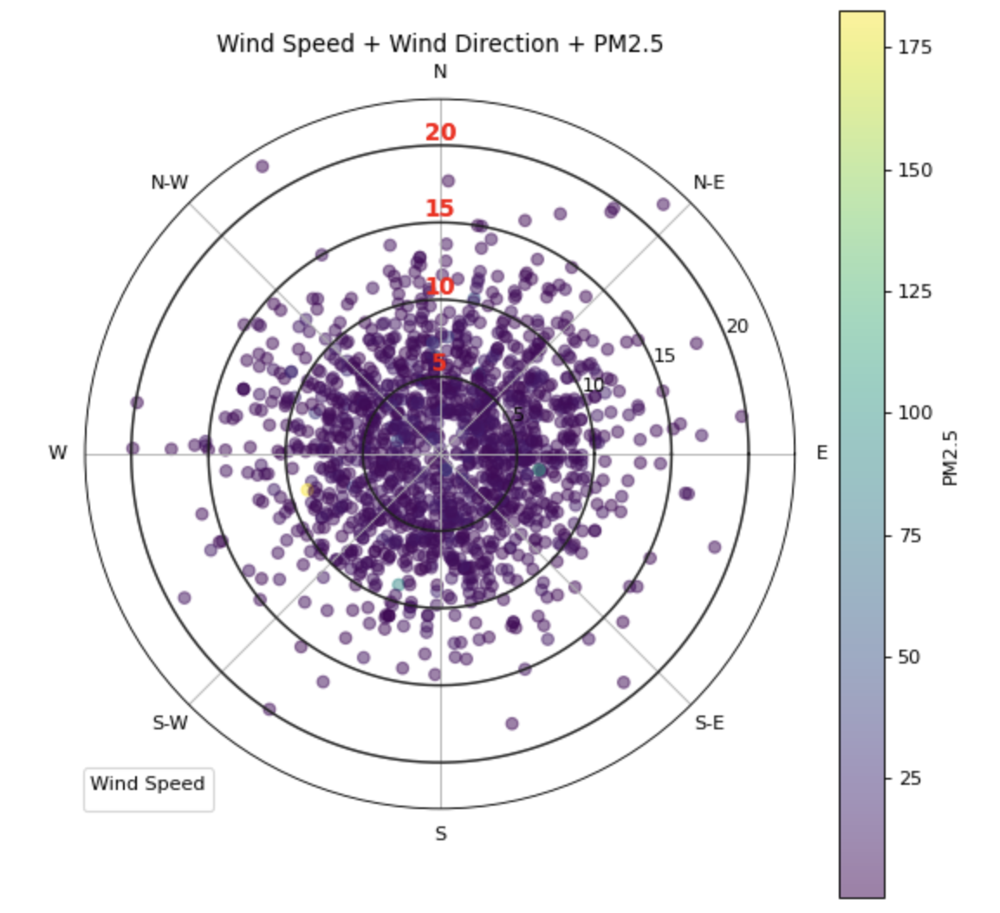
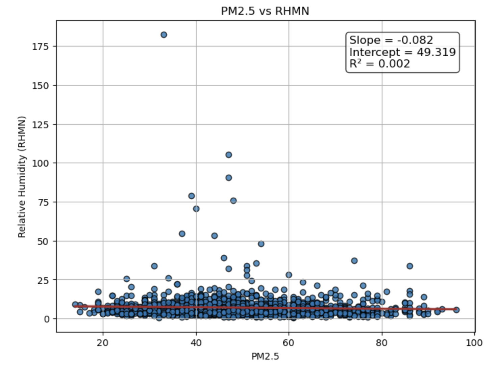
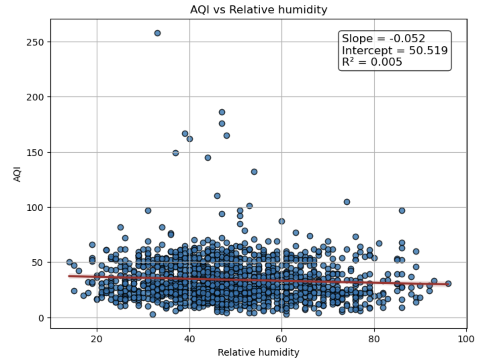

# Weather and Air Quality Data Integration
## Aby Joe Jose, Meenakshy Manju

### 1. Introduction

This project integrates historical air quality data (PM2.5) from the U.S. Environmental Protection Agency (EPA), weather data from the National Oceanic and Atmospheric Administration (NOAA) and wind direction from Open-Meteo Weather Archive API for two locations in New York: Albany, NY and Syracuse, NY

The goal is to build a clean, merged dataset that combines meteorological variables with PM2.5 values and store them in a normalized relational database to support further analysis and visualization. Data were collected for the years 2023, 2024 and 2025.

### 2. Data Sources
#### EPA Air Quality System (AQS)

API endpoint: https://aqs.epa.gov/data/api/dailyData/byCounty

API Documentation: https://aqs.epa.gov/aqsweb/documents/data_api.html#daily

| City          | State Code | County Code | Parameter Retrieved | Parameter Name | Included in Dataset |
| ------------- | ---------- | ----------- | ------------------- | -------------- | ------------------- |
| Albany, NY    | 36         | 001         | 88101               | PM2.5          | Yes                 |
| Syracuse, NY  | 36         | 067         | 88101               | PM2.5          | Yes                 |
| Buffalo, NY   | 36         | 029         | 88101               | PM2.5          | No                  |
| Rochester, NY | 36         | 055         | 88101               | PM2.5          | No                  |

#### NOAA Climate Data Online (CDO) API

API endpoint: https://www.ncdc.noaa.gov/cdo-web/api/v2/data

API Documentation: https://www.ncdc.noaa.gov/cdo-web/webservices/v2#datasets

Dataset ID: GHCND (One datapoint per day)

NOAA Weather Stations:
| City         | Station ID  |
| ------------ | ----------- |
| Albany, NY   | USW00014735 |
| Syracuse, NY | USW00014771 |
 

NOAA Variables Collected:
| Variable | Description         |
| -------- | ------------------- |
| TMAX     | Maximum temperature |
| TMIN     | Minimum temperature |
| PRCP     | Precipitation       |
| SNWD     | Snow depth          |
| AWND     | Average wind speed  |
| RHMN     | Relative humidity   |

#### Open-Meteo Weather Archive API (Wind Direction)

The NOAA API does not provide daily dominant wind direction in an accessible form. To fill this gap, daily wind direction was retrieved from the Open-Meteo Historical Weather Archive.

API endpoint: https://archive-api.open-meteo.com/v1/archive

API Documentation: https://open-meteo.com/en/docs#api_documentation

Variables Collected:

| Variable                    | Description                   |
| --------------------------- | ----------------------------- |
| wind_direction_10m_dominant | Daily dominant wind direction |

### 3. Data Extraction
#### EPA AQS Extraction

The script loops through: 
a. 2 cities 
b. 3 year ranges 
c. Retrieves JSON 
d. Converts to Pandas DataFrame 
e. Adds city name 
f. Stores for merging 

Key cleaning steps: 
a. Convert date_local to datetime 
b. Rename arithmetic_mean - PM25 
c. Group by date/county 
d. Standardize county names 

The output was saved as pm25_by_county_23_25.csv

#### NOAA Weather Extraction

The script retrieves 6 weather variables for each city and date range. A pivot operation restructures the data from: date, datatype, value to date, AWND, PRCP, SNWD, RHMN, TMAX, TMIN, city 

Raw weather observations were pivoted to create a wide-format dataset with one row per city per day. 

The output saved as: weather_data_23-25.csv

#### Open-Meteo Wind Direction Extraction

a. Query daily wind_direction_10m_dominant 
b. Loop through both cities 
c. Parse and store date + city + wind direction 

The output was saved as Wind_direction.csv

### 4. Inserted in MySQL Database

Inserted data into a MySQL database by creating a well-structured table and uploading datapoints asynchronously.

| Column Name | Key/Constraint   | Description|
| ----------- | --------- | ----------------|
| TID         |Primary Key      | Auto-incremented unique ID    |
| Date        |Unique with City | Date of the record            |
| City        |Unique with Date | Name of the city              |

### 5. Discussions

#### Wind Speed + Wind Direction + PM2.5 Polar Plot
 

 
The plot encodes the three variables as follows:

Angle (θ): Wind direction in degrees 
| Degrees (°) | Wind Direction |
| ----------- | -------------- |
| 0°          | North          |
| 90°         | East           |
| 180°        | South          |
| 270°        | West           |

Radius (r): Wind speed (AWND)

Concentric rings represent increasing wind speeds (e.g., 5, 10, 15 mph)

Color: PM2.5 concentration 
Lighter shades - lower PM2.5 
Darker shades - elevated PM2.5 levels

Higher PM2.5 concentrations are most commonly observed during low wind-speed conditions, as shown by the darker points clustered near the center of the polar plot. This indicates that stagnant or slow-moving air reduces atmospheric dispersion, allowing particulate matter to accumulate near the surface an effect widely documented in urban air quality studies. While low wind speeds dominate high-PM2.5 events, certain wind directions also show small clusters of elevated pollution levels. North eastern direction exibit slightly more pm2.5 concentration than other directions.

In contrast, days with higher wind speeds generally correspond to much lower PM2.5 levels, as stronger winds disperse pollutants more efficiently. This highlights the critical influence of meteorological conditions on air quality variability. By combining wind speed, wind direction, and PM2.5 into a single visualization, this plot provides a deeper understanding of pollution behavior revealing stagnant-air events, identifying potential pollution transport pathways, and clarifying why air quality can vary significantly even when emissions remain constant. Such insights are valuable for forecasting, policy planning, assessing exposure risk, and optimizing sensor placement.

#### PM2.5 v/s Relative humidity
 

There is no correlation between PM2.5 and relative humidity

 

#### AQI v/s Relative humidity
 

There is no correlation between AQI and relative humidity

 

### 6. Challenges
#### Attempt to Use AirNow for Weather Data

At the beginning of the project, an attempt was made to collect weather data from the AirNow API. While AirNow provides reliable information on current air quality conditions, the service does not offer historical weather datasets. The API is designed primarily for real-time and forecast data, which made it unsuitable for this project’s objective of gathering historical data from 2023 to 2025.